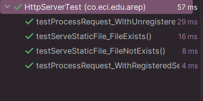

# HttpServer

Este proyecto implementa un servidor HTTP simple que escucha las solicitudes entrantes, las maneja sirviendo archivos estáticos o ejecutando servicios predefinidos, y devuelve las respuestas correspondientes. El servidor puede servir archivos estáticos (como HTML, CSS, JS) y también admite rutas personalizadas con contenido dinámico.

## Descripción del Proyecto

La clase HttpServer es un servidor HTTP ligero construido en Java que maneja solicitudes HTTP. Puede servir tanto contenido estático (por ejemplo, archivos HTML) como contenido dinámico a través de servicios personalizados. El servidor está diseñado para procesar solicitudes HTTP GET y devolver las respuestas adecuadas, ya sea sirviendo un archivo estático o devolviendo datos en formato JSON desde un servicio especificado.

## Empezando

Estas instrucciones te guiarán para obtener una copia del proyecto y ponerlo en funcionamiento en tu máquina local para desarrollo y pruebas.

## Prerrequisitos

Para ejecutar este proyecto, necesitas tener instalados los siguientes elementos:

- Java 8 o superior
- Un editor de texto (como Visual Studio Code, IntelliJ IDEA, etc.)
- Maven (opcional, si deseas compilar con Maven)

## Instalación

Clona el repositorio:

```bash
git clone https://github.com/Andrea2511/AREP_Taller2.git
```

## Explicación del Código

- **HttpServer.java:** Este código en Java implementa un servidor HTTP que puede servir tanto archivos estáticos como contenido dinámico utilizando servicios predefinidos.

## Componentes clave:

- **Inicialización del servidor:** El servidor escucha en el puerto 8080 y acepta conexiones de clientes de forma continua. Cada conexión es manejada por handleRequest.


- **Parseo de la solicitud:** Cuando un cliente envía una solicitud, el servidor parsea la solicitud HTTP, extrayendo el método (GET, POST, etc.) y la URI. La URI se divide en las partes de la ruta y la consulta.


- **Contenido dinámico:** Si la solicitud coincide con una ruta predefinida, el servidor utiliza la función del servicio correspondiente (almacenada en servicios) para generar una respuesta dinámica.


- **Contenido estático:** Si la ruta solicitada hace referencia a un archivo estático, el servidor intenta servirlo. Si el archivo no se encuentra, devuelve un error 404 Not Found.


- **processRequest:** Este método verifica si la ruta está mapeada a un servicio. Si es así, llama al servicio correspondiente para generar una respuesta dinámica. Si no, sirve el archivo estático.


- **Manejo de rutas:** El método get permite registrar rutas personalizadas que serán manejadas por un servicio. Por ejemplo, HttpServer.get("/api/endpoint", myService) registra la ruta /api/endpoint.


- **Archivos estáticos:** El método serveStaticFile sirve archivos desde el directorio WEB_ROOT. Si el archivo no se encuentra, devuelve un archivo error.html o un mensaje genérico de 404 Not Found.


- **Detección de tipo MIME:** El método getContentType determina el tipo MIME de un archivo según su extensión, asegurando que se envíe el encabezado Content-Type correcto en la respuesta.

## Desglose del Código:

- **start:** Inicializa un ServerSocket en el puerto 8080 y escucha las conexiones entrantes de los clientes.


- **handleRequest:** Lee la solicitud HTTP, parsea la URI y delega la solicitud al manejador de servicios o archivos estáticos.


- **processRequest:** Recupera la función de servicio correspondiente para una solicitud y formatea la respuesta. Si no se encuentra el servicio, devuelve una respuesta 404.


- **get:** Registra una nueva ruta con su servicio asociado para manejar contenido dinámico.


- **serveStaticFile:** Intenta servir un archivo estático desde el directorio WEB_ROOT. Si el archivo no se encuentra, devuelve una respuesta 404 Not Found o una página de error personalizada.


- **getContentType:** Devuelve el tipo MIME adecuado para un archivo según su extensión.

## Despliegue

Para desplegar este proyecto en un sistema en vivo:

1. Compila el proyecto usando Maven o compílalo manualmente.
2. Sube los archivos .class compilados y el directorio src/main/resources a tu servidor.
3. Asegúrate de que el entorno de Java esté correctamente configurado en el sistema en vivo.
4. Ejecuta la clase HttpServer en tu máquina servidor.

## Pruebas



## Herramientas Usadas

- Java - Lenguaje de programación utilizado
- Maven - Gestión de dependencias (opcional)
- JUnit - Usado para pruebas

## Versioning

1.0.0